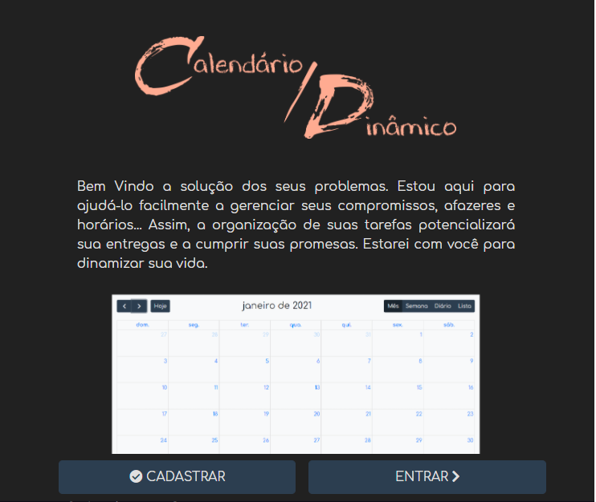
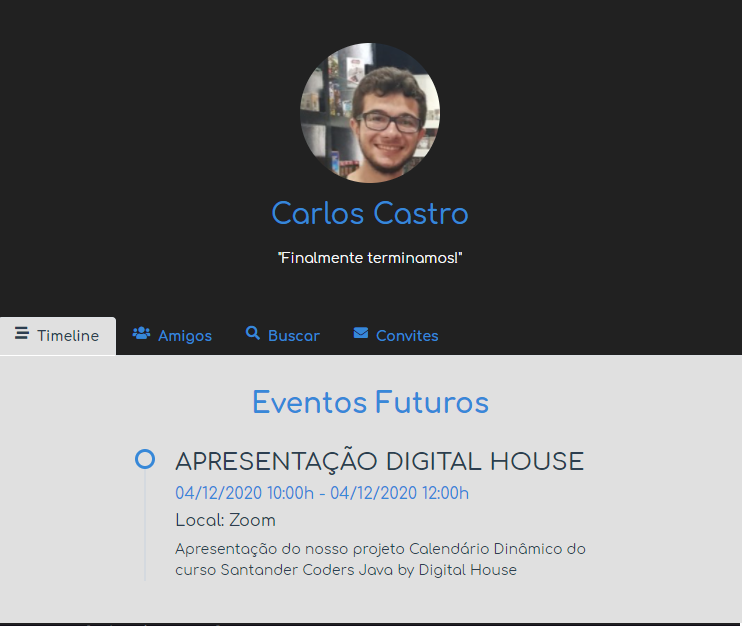
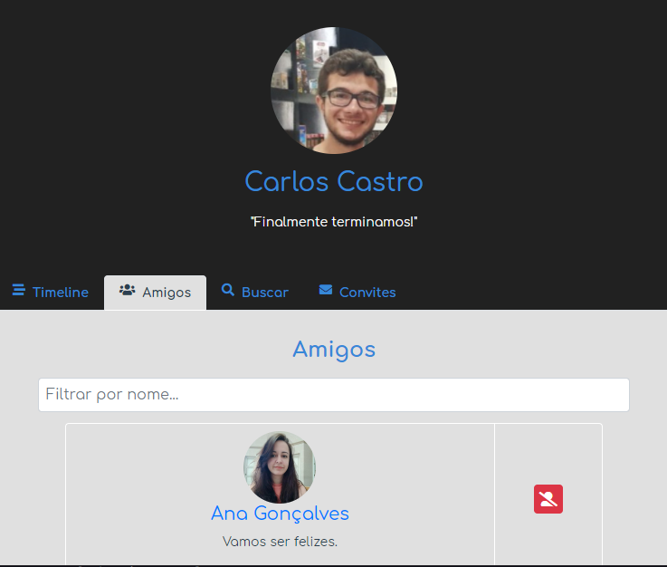
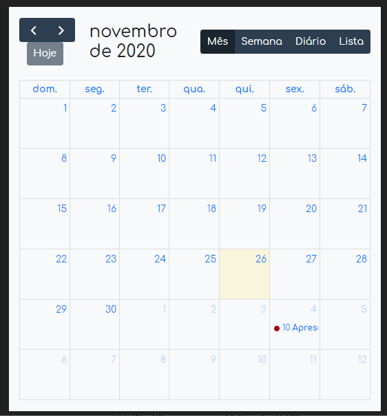
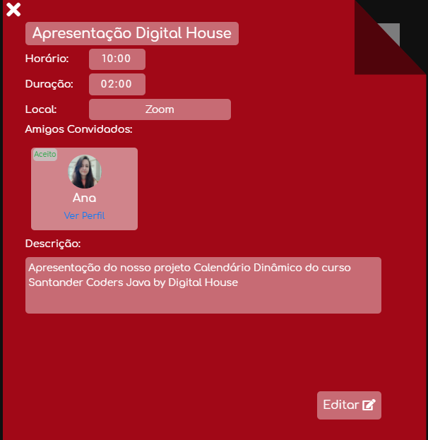

 <p align="center">
   
 </p>

## Índice

- [Santander Coders Java by Digital House](#santander-coders-by-digital-house)
- [Calendário Dinâmico](#calendario-dinamico)
- [Screenshots](#screenshots)
- [Techs](#techs)
  - [Frontend](#front-end)
  - [Backend](#back-end)
  - [Deploy](#deploy)
- [Como rodar](#como-rodar)
- [Contato](#contato)

## Santander Coders Java by Digital House

Projeto integrador desenvolvido durante o curso de Desenvolvimento Web Full Stack Java oferecido pela [Digital House](https://www.digitalhouse.com/br/) em parceria com o Santander.
<br>

## Calendário Dinâmico

O projeto é uma aplicação web com duas funcionalidades principais: marcar eventos e convidar amigos para esses eventos. É possível marcar eventos como públicos ou privados, além editar e apagar eventos já criados.

## Screenshots

<p align="center">
   
  
  
  
  
<p>

## Techs

As seguintes ferramentas foram utilizadas durante o desenvolvimento do projeto:

### Front end

- **[HTML](https://developer.mozilla.org/pt-BR/docs/Web/HTML)**
- **[CSS](https://developer.mozilla.org/pt-BR/docs/Web/CSS)**
- **[JS](https://developer.mozilla.org/pt-BR/docs/Web/JavaScript)**
- **[jQuery](https://jquery.com/)**
- **[Bootstrap](https://getbootstrap.com/)**
- **[React](https://pt-br.reactjs.org/)**
- **[React Slick](https://react-slick.neostack.com/)**

### Back end

- **[Java](https://www.java.com/pt_BR/)**
- **[MySQL](https://www.mysql.com/)**
- **[Spring Boot](https://spring.io/projects/spring-boot)**

### Deploy

- **[Heroku](https://heroku.com)**
- **[Firebase](https://firebase.google.com)**
- **[Free MySQL Hosting](freemysqlhosting.net)**

## Como rodar

```bash
## Clonar o repositório
git clone https://github.com/carloscastrodev/DinamicCalender

## Acessar o diretório novo criado
cd DinamicCalender

## Para rodar o backend, utilize a sua IDE java preferida. (EX: Eclipse)
## Com a sua IDE aberta, importe um projeto Maven existente e selecione a pasta "api"
## É necessário configurar as seguintes variáveis de ambiente
- FREE_MYSQL -> URL de conexão com o banco de dados MySQL
- JWT_SECRET -> Segredo de assinatura do JWT
- APP_URL -> URL do front-end da aplicação (http://localhost:3000 para projeto React rodando localmente)
- MAIL_ADDRESS -> Email GMAIL que enviará mensagens de recuperação de senha
- MAIL_PASS -> Senha do email
- MAIL_NAME -> Nome que aparecerá no email

## Para rodar o frontend, navegue para a pasta "client" pelo terminal e instale as dependências:
yarn

## Depois de instalado, para executar a aplicação:
yarn start
```

## Contato

- Ana Caroline Gonçalves - [goncalves-ac](https://github.com/goncalves-ac) -

- Carlos Castro - [carloscastrodev](http://github.com/carloscastrodev) - contato-carloscastro@hotmail.com

- Luan Fernandes - [souluanf](https://github.com/souluanf) - souluan@live.com

- Matheus Emanoel Rodrigues de Albuquerque - [mts-emanoel](https://github.com/mts-emanoel) -
